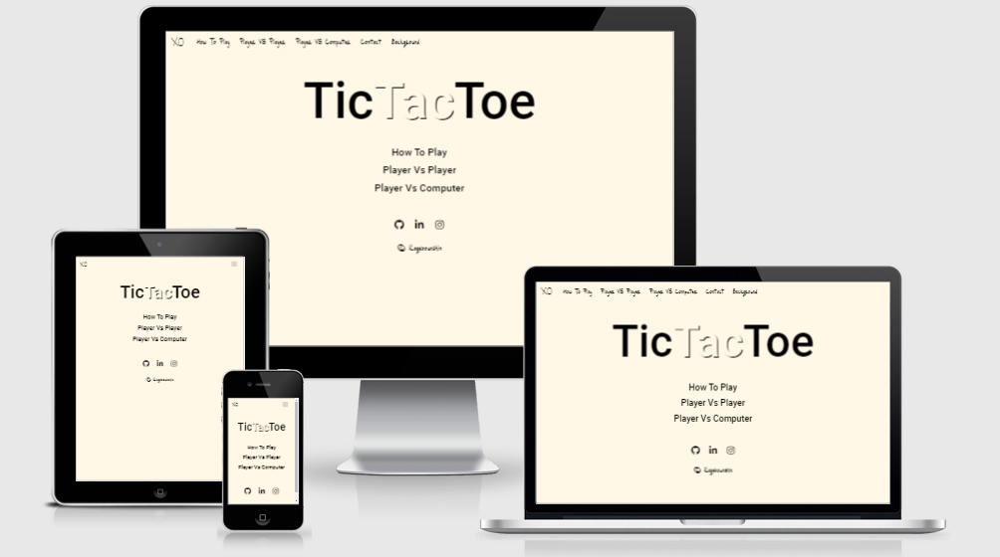

<h1 align="center">TicTacToe</h1>

[View the live project here.](https://kagebounshin.github.io/tictactoe-milestoneProjectNr2/)

Welcome to my second milestone project provided by [Code Institute](https://codeinstitute.net). For this project I am going to do a Tic Tac Toe Game. I hope you will enjoy it!

<h2 align="center"></h2>

## Table Of Content
1.[**UX**](#user-experience) 
- [**User Stories**](#user-stories)
- [**Strategy**](#strategy)
- [**Scope**](#scope)
- [**Structure**](#structure)
- [**Skeleton**](#skeleton)
    - [**Wireframes**](#wireframes)
- [**Surface**](#surface)
    - [**Design**](#design)


2.[**Features**](#features)
- [**Existing Features**](#existing-features)
- [**Features For The Future**](#features-for-the-future)

3.[**Technologies**](#technologies-used)


4.[**Testing**](#testing)

5.[**Deployment**](#deployment)

6.[**Credits**](#credits)
- [**Content**](#content)
- [**Media**](#media)
- [**Acknowledgements**](#acknowledgements)

---

## User Experience


### User stories


- As a First Time Visitor,

    1. I want to get clear instructions on how the site works, what you can do, and how to do it.
    2. I want to easily navigate my way through the website. 

- As a Player,
    1. I want the game to be played easily.
    2. I want to be able to play against a friend.
    3. I want to be able to play against the computer.
    4. I want it to have nice estetics. 
    5. I want feedback once the game is done, such as who won, and whats the score. 
    6. I want to restart the game when the game is finished.

### Strategy

---

- My targeted audience for this project is children somewhere between the ages of 4-9 years old. In most cases when two adults plays against each other it ends in a draw, unless your not familiar with the basic strategy of the game. So the Tic-tac-toe game is very simple, so it's well suited for children who dont already know the basic strategy. So I will try to make it appealing to kids at first. Having in mind what kids are interested in now a days, games, toys, etc. 

- I made up a very simple [chart](assets/img/img-readme/chartOfImportance.png), by asking my own kids and some of their friends. I wanted to know their thought on what they think is important for this project. So they had three choices to make, between "Game Play", "Styling" and the "Contact page". They were going to rank these choices between 1-3.


- The one who got the most points was "Styling". And I intend to agree, if my main target is children, I want it to look interesting and fun. Have things going on in the background. Other things to interact with besides the game itself. So the kids will keep on playing, and visit the site again. 
- The second most was the "Game Play" choice. Though I would think it's more important then the styling. Without a functional game, then what's the purpose of the page. 
- Not a shocker that the "Contact Page" got the least points. So I will focus on doing a visually striking and fun game at first. The implementing of a "Contact Page" will maybe be a feature to add in the future. But if I feel that I've got the time to do it, then I probably will. 

### Scope

---

- So alot of styling and a fun and intuitive gameplay is most important.
- The first thats needed are instructions, what the game is about and how does it work. Ofcourse it's a simple game, but when you are approaching children I think it's best to be as clear as you can be, sort out the questions they may have, before you even start the game. 
I will implement some easy to understand instructions to be shown when they enter the site. The instructions will be picture based, showing them the steps you need to take to win the game. 
I'm thinking three pictures wich displays three winning combinations horizontally, vertically & diagonally. And a picture wich displays a tie. Look at the instruction [**wireframe**](#wireframes) to see my idea.
- There will be a text displaying whos turn it is. 
- To make it more fun to play I will put in a countdown timer, so the choices they make must be made quickly, if the time runs out, the game stops, and it's game over.
- I also going to implement a scoreboard, displaying how many matches each of the players have won. So that you'll get that competetive feeling. 

### Structure

---

- Navbar
    - At the top of the page I will have a navigation bar. There will not be much to navigate between at first just the "Game" and the "Contact" page. 
    - When shown on smaller devices the navigation links will collapse into a toggler menu. With a button to click to reveal the links.
    - When you'll hover the brand or one of the links, the links will response with an effect. Just to make it easier to understand that they can be clicked. 
    - By having the navbar at the top it will be easy to spot at your first visit to the site. 

- Game Page

    - The "Game" page will be the home page of this site.
    - The gameboard will be displayed at the center of the page. The board will have a 3x3 grid, all with equally sized squares, in these squares you will put your X's & O's. When you hover over the diffrent squares they will respond. So you'll know wich square your about to put your mark on. 
    - Above the gameboard to the left there will be a text wich will display who's turn it is. 
    - Above the gameboard to the right, there the countdown timer will be.
    - Below the gameboard there will be a restart button.
    - Below the gameboard there will also be a scoreboard.
    - At the end of the game, the winner will be displayed, and you will be able to restart the game by the click of a button.

- Tutorial Page
    - If your not entirely sure on how to play Tic-Tac-Toe, dont worry, I've implemented and easy to understand tutorial page.
    - The page display pictures on the three diffrent ways you can win, and how a possible "Tie" situation looks like. 
    - And it explains the timer and the turn containers. 

- Contact Page
    - The "Contact" Page will have a form centered at the page. there will be a simple looking form, were you can enter your name, email, and feedback.
    - The form will be conected with emailJS.
    - Below the form their will be links to my LinkedIn, gitHub & Instagram.

- Late Development
    - Late in the development, me and my mentor decided to also have a Player VS Computer game. So I made a new page, wich looks exactly like the Player Vs Player page, just with some minor changes. And made a script for it to work properly. 
    - I also made a home page, becouse I got two diffrent game pages, I wanted you to enter the site on neutral grounds. So you could choose wich type of game to play from there. 
### Skeleton
---


-   ### Wireframes

    [Game Page](assets/img/img-readme/wfHome.png)

    [Contact Page](assets/img/img-readme/wfContact.png)

    [Instruction modal](assets/img/img-readme/wfInstructions.png)


### Surface 

---

### Design

#### Colour Scheme
- Text Colors

    - The text color of all the pages is set to have the color black ([#000000](assets/img/img-readme/000000.png)). On the game pages there are some text styled with the color white ([#ffffff](assets/img/img-readme/ffffff.png)). The text in the form at the contact page has as more grey ([#212529](assets/img/img-readme/212529.png)) color set to it.
        
- Navbar

    - The Navbar has a cream white ([#fff8e6](assets/img/img-readme/fff8e6.png)) background, I wanted a more smooth and pleasing color instead of a basic white ([#ffffff](assets/img/img-readme/ffffff.png)). 
       

- Home page, Game pages & Contact Page
         
    - At the Home page, game pages & the contact page you can click a button wich will randomly change the background color, the colors wich the background can randomly changes to is [#25876f](assets/img/img-readme/25876f.png), [#7fc3cc](assets/img/img-readme/7fc3cc.png), [#fc9819](assets/img/img-readme/fc9819.png), [#3451c6](assets/img/img-readme/3451c6.png), [#D45B64](assets/img/img-readme/D45B64.png), [#ffbd89](assets/img/img-readme/ffbd89.png), [#ba50f7](assets/img/img-readme/ba50f7.png), [#fff8e6](assets/img/img-readme/fff8e6.png).
       

    - The Gameboard has the cream white ([#fff8e6](assets/img/img-readme/fff8e6.png)) color as background, and the box shadow is faded to 65% from the color black ([#000000](assets/img/img-readme/000000.png)).

- Tutorial Page

    - The background for the tutorial page is set to a light blue color ([#7fc3cc](assets/img/img-readme/7fc3cc.png)). 

---
#### Typography

- The fonts I've used across the site are from [Google Fonts](https://fonts.google.com/). The fonts are, 'Just Me Again Down Here', 'Waiting for the Sunrise', 'Sacramento' & 'Roboto'. 
    - ['Just Me Again Down Here'](https://fonts.google.com/specimen/Just+Me+Again+Down+Here?query=Just+Me+Again+Down+Here) is used as the main font, the links on the navbar, and most of the informative paragraphs across the site. 
    - ['Waiting for the Sunrise'](https://fonts.google.com/specimen/Waiting+for+the+Sunrise?query=Waiting+for+the+Sunrise) is used for the X's and O's, the secounds on the countdown timers & the numbers on the scoreboards.
    - ['Sacramento'](https://fonts.google.com/specimen/Sacramento?query=Sacramento) was used for the page logo. 
    - [Roboto](https://fonts.google.com/specimen/Roboto?query=roboto) is used for the "Tic Tac Toe" header on the homepage, and the text inside the form on the contact page. I thought that the header looked much more nice with a diffrent font, I wanted it to stand out from the rest of the site. And for the form I wanted to have this font because it's more readable then the main font, nice to have when you're typing. 

---
         
## Features

- Navbar
    - All the pages has the same looking [Navbar](assets/img/img-readme/navbar.png). The [Navbrand](assets/img/img-readme/navbrand.png) takes you to the Homepage. 
    - There is a "[Background](assets/img/img-readme/bgButton.png)" button, and guess what, it changes the background of the page (not implemented on the tutorial page).  

- Home Page
    - The home page has a [Header](assets/img/img-readme/headerHome.png) wich reads 'Tic Tac Toe',
    underneath that header are [links](assets/img/img-readme/linksHome.png) to the tutorial page and the two diffrent game pages. These links are also at the navbar, but I wanted you to be able to quickly choose where to go on the website, especially on your mobile where the navbar is collapsed. And that it would be reminiscent of a game menu.
     Below all of that are [links](assets/img/img-readme/linksHome1.png) to my gitHub, linkedIn and Instagram accounts.
- Game Pages
    - The [Gameboard](assets/img/img-readme/gameboard.png) is at the center of the screen, the 9 diffrent spaces where you can make your mark has a hover effect on them, the effect slightly shrinks the hovered space. 
    - The game pages has a text wich displays whos "[Turn](assets/img/img-readme/turn.png)" it is. The Game is set to start with the player "X" as default. When you start playing, the text switches between the player "X" & "O".
    - There is a "[Timer](assets/img/img-readme/timer.png)" wich count down from 15 on the Player vs Player page, and 10 for the Player vs Computer page. If the timer run out, the game is over. 
    - Below the gameboards there is a" [Scoreboard](assets/img/img-readme/scoreboard.png)", wich display's the score for both players. To get one point you need to win the match, if the game ends in a tie, nobody gets a score. 
    - No matter the out come of the game, a "[Modal](assets/img/img-readme/modal.png)" will fade in. At the bottom of the modal is a "Play Again" button, click the button, and the game restarts. Or click the house icon to return the the Home Page. 

- Tutorial Page
    - Here are four pictures wich displays three ways to win a game, [horizontally](assets/img/img-tutorial/win1.png), [vertically](assets/img/img-tutorial/win2.png) &  [diagonally](assets/img/img-tutorial/win3.png). And a picture wich displays a [tie](assets/img/img-tutorial/tie.png).
    - Below the pictures is [explainations](assets/img/img-readme/explain.png) for the Countdown timer, turn display & Score counter. 

- Contact Page
    - Send [feedback](assets/img/img-readme/feedback.png) to me, or visit me on [gitHub, Instagram or LinkedIn](assets/img/img-readme/linksContact.png). 

- Extra
    - Responsive across different platforms. 

## Features for the future

- At the Player VS Player page, I would like to implement so that the players can set there name, so that the turn order is displayed with the players names instead of the "X" and the "O".
- At the Player vs Computer page, I would like you to choose if you want to be the 'X' or the 'O'. 
- At the Player vs Computer page, I Would like to implement difficulties, easy, medium or hard. Lets say if you where to choose hard, the computer would be harder to beat. 
- I would like to implement audio to the gameboard, so when any tile is clicked, a click sound is played. Or when the countdown timer has a few secounds left.

---

## Technologies Used

### Languages Used

-   [HTML5](https://en.wikipedia.org/wiki/HTML5)
-   [CSS3](https://en.wikipedia.org/wiki/Cascading_Style_Sheets)
-   [JavaScript](https://www.javascript.com/)

### Frameworks, Libraries & Programs Used

- [jQuery](https://jquery.com/)

- [Bootstrap v5.0](https://getbootstrap.com/docs/5.0/getting-started/introduction/)

- [Hover.css](https://ianlunn.github.io/Hover/) - Hover effect on buttons links.

- [FontAwesome](https://fontawesome.com/) - provides icons across the site

- [GoogleFonts](https://fonts.google.com/)

- [Git](https://git-scm.com/) - Git was used for version control.

- [GitHub](https://github.com/) - GitHub was used to store the project.

- [GitHubPages](https://pages.github.com/) - Deployment

- [Balsamiq](https://balsamiq.com/) - Balsamiq was used to create the wireframes.

- [Am I Responsive](http://ami.responsivedesign.is/#) - Tested responsivness & the images at the top of the readMe.

- [Color Hex](https://www.color-hex.com/) - The color images wich are displayed at the [**Design**](#design) section of this readMe.

- [EmailJS](https://www.emailjs.com/) - For the contact form.

- [favicon.ico Generator](https://www.favicon.cc/) - For creating the favicon.

- [Amp What](https://www.amp-what.com/) - For the copyright icon at the home page. 
---

## Testing

The W3C Markup Validator and W3C CSS validator Services were used to validate this project. 

- [W3C Markup Validator](https://validator.w3.org/) - [Results](https://validator.w3.org/nu/?doc=https%3A%2F%2Fkagebounshin.github.io%2Ftictactoe-milestoneProjectNr2%2F)
- [W3C CSS Validator](https://jigsaw.w3.org/css-validator/#validate_by_input) 
    - 404 - [Results](assets/img/img-readme/404W3C.png)
    - Contact - [Results](assets/img/img-readme/ContactW3C.png)
    - Cpu - [Results](assets/img/img-readme/cpuW3C.png)
    - Game - [Results](assets/img/img-readme/gameW3C.png)
    - Style 
        - [Results](assets/img/img-readme/styleW3C.png)
        - [Warnings](assets/img/img-readme/styleW3CWarnings.png)

    - Tutorial 
        - [Results](assets/img/img-readme/tutorialW3C.png)
        - [Warnings](assets/img/img-readme/tutorialW3CWarnings.png)
    - Welcome 
        - [Results](assets/img/img-readme/welcomeW3C.png)
        - [Warnings](assets/img/img-readme/welcomeW3CWarnings.png)

### Lighthouse Testing

---

- Home Page
    - Mobile [Result](assets/img/img-readme/lightHomeMobile.png)
    - Desktop [Result](assets/img/img-readme/lightHomeDesk.png)
- Player VS Player (Game Page)
    - Mobile [Result](assets/img/img-readme/lightPVPMobile.png)
    - Desktop [Result](assets/img/img-readme/lightPVPDesk.png)
- Player VS Computer (Game Page)
    - Mobile [Result](assets/img/img-readme/lightPVCMobile.pngg)
    - Desktop [Result](assets/img/img-readme/lightPVCDesk.png)
- Tutorial Page
    - Mobile [Result](assets/img/img-readme/lightTutMobile.png)
    - Desktop [Result](assets/img/img-readme/lightTutDesk.png)  
- Contact Page
    - Mobile [Result](assets/img/img-readme/lightContactMobile.png)
    - Desktop [Result](assets/img/img-readme/lightContactDesk.png)
---

## Testing User Stories from User Experience (UX) Section

- First time Visitor,
    1. I want to get clear instructions on how the site works, what you can do, and how to do it.
        - When entering the site, users can easily navigate their way through the site, using the navbar at the top. Below there is a large text wich reads "Tic Tac Toe", links to a tutorial page and two diffrent game pages & links to the authors gitHub, LinkedIn and Instagram accounts. 
        - The header explains the soul purpose of the page.
        - The links below the main text give you three options, you can go to the tutorial page, or just start playing by choosing you're preferred game type. These three links are also avalible at the navbar. 
        - There is also a "How to play" page, wich explains the diffrent ways I can win, or what happens if there is no winner. It also explains whats going on around the gameboard.
    2. I want to easily navigate my way through the website.
        - With the existing navbar I can easily navigate my way through the site. When shown on smaller devices, the navbar collapses into a burger menu.

- As a Player,
    1. I want the game to be played easily.
        - Player VS Player
            - When I located the game page, a modal appears, explaining the game type I have choosed. That the game has a countdown timer. Also that the 'X' start. At the bottom of the modal is a play button.
            - When I press play, the game start. 
            - The game takes turn between the 'X' & the 'O'. If you loose track of whose turn it is, you can look to the left above the gameboard, there you have a text wich shows whos turn it currently is.
            - When you win a game either as 'X' or 'O', or if the time has run out, or if the game ends with a draw. A modal fades in and discribes the out come of that game, and I can easily restart the game by pressing the "Play Again" button on the modal. 
            - The countdown timer is counting down from 15 seconds, when it's 3 seconds left, the color of the seconds changes to 'Red'. When the timer reaches 0, a modal fades in, explaining that the time has run out & a button were I can choose to play once more.
        - Player VS Computer
            - I go to the desired page, using the navbar. A modal appears, explaining the game type I have choosed. That you play against the computer , that the game has a countdown timer. Also that you play as the 'X'. At the bottom of the modal is a play button.
            - I press the play butto, the game is on.
            - I am the one to make the first mark, after the computer make a random mark at the gameboard. I play until I win.
            - A modal fades in, and I can click a "Play Again" button to start a new round. 

    2. I want to be able to play against a friend.
        - Player VS Player
            - When I located the Player VS Player page, I can start playing with friends or family, either by passing the Computer mouse or the phone between each other. The time pressure and the scoreboard adds in a little extra competitive feeling.

    3. I want to be able to play against the computer.
        - Player VS Computer
            - When I have located the Player VS Computer page, I can start playing against the computer, I am playing as the 'X'. I make a my mark, and then the computer make a mark. It goes on until there is a winner, tie or if the time has run out. A modal appears and I can choose to play again.
    4. I want it to have nice estetics. 
        - Quotes from family & Friends. 
            - "I think it looks nice, and is easy to understand." Love, 8 years old.
            - "It is pretty, and the game is fun, I like to change the background, the pink one is my favorite" Saga, 5 years old. 
            - "I think it's a fun game to play with my kids or just playing against the computer. I like the colors, they are very pleasing for the eye" Jenny, 30 years old.

    5. I want feedback once the game is done, such as who won, and whats the score. 
        - When either of the players or the computer wins, a modal fade in with a text that says who has won or if there was a 'Tie' or if the time has run out. 
        - Underneath the gameboard there is a scoreboard, if you win you'll get one point, if it's a 'Tie' the scoreboard remains unchanged. 
    6. I want to restart the game when the game is finished.
        - No matter the out come of the game, a modal will fade in. At the bottom of the modal is a "Play Again" button, click the button, and the game restarts. 
---

## Game Testing

#### Player VS Player
- Make Mark
    - I enter the site, I'll make my mark anywhere at the gameboard, and an "X" appear
    - The next mark I make displays an "O". 
    - Now it is the X's turn again, I try to click where the "O" was marked, nothing happends. I need to choose an unoccupied space at the gameboard. 
    - I fill up the rest of the gameboard, switching between the X's and O's
- Take Turns
    - The turn display shows that the X's goes first
    - When I make my first mark on the gameboard, an X appears on the clicked element
    - The turn container switches to display that it's the O's turn
    - I make a new mark and an O appears on the gameboard.
    - The turn container switches back to display that it's the X's turn once again
- Score Counter
    - I play a game and player "X" wins.
    - The score counter for player "X" increases with 1.
    - I play a game and player "O" wins.
    - The score counter for player "O" increases with 1.
    - I play a game and make it a "Tie".
    - The Score is unchanged
- Timer
    - I start the game
    - When the time has run out, a modal appears, and I can choose to play again. 
- Restart Button
    - I wait for the time to run out, so I can see the game over message.
    - I click the restart button and the game restarts
    - I play a game and winning with player "X".
    - I click the restart button and the game restarts
    - I play a game and winning with player "O".
    - I click the restart button and the game restarts
    - I play a game and I make it a "Tie".
    - I click the restart button and the game restarts

#### Player VS Computer
- Make Mark
    - I start by making a mark, and an 'X' appears.
    - Just as I make my mark the computer marks the gameboard with an 'O'.
    - It's my turn again, I try to mark over the computers 'O'. I dosen't work. I need to find an unoccupied space. A make my mark. 
    - Continuing doing this until one of us wins.
    - I can restart the game, and the gameboard is cleard of all the marks & the timer is reset. And if any one has won, the score increases with 1. 
---
    
### Testing of the contact form
- When I enter the site, I locate the contact link at the navbar.
- I click the link and it takes me to the Contact page.
- The page have a feedback form, before submitting the form, I enter my name, emailaddress and a feedback message. 
- I click at the "Send" button under the form, The message is sent to my Gmail account, the form is reset back to it's default state, and it displays a message above the form thanking you for submitting. 
- If I dont fill in the form correctley before submitting, lets say leaving the email input window empty, a message will be displayed saying I need to include a emailaddress if I want to submit the form. 
- The icons at the bottom take you to gitHub, LinkedIn & Instagram.  

### Further Testing

- This project was tested different webbrowsers, Google Chrome & Microsoft Edge, Safari.
- This project was tested different devices such as Desktop, Laptop, Ipad, Iphone 12 Pro, Iphone X, Iphone 8 & Iphone 7, Sony xperia Z1.
- The links are tested alot, to ensure they work correctly.
- Friend & Family members has tested the site, looking for bugs and other issues.                  


### Bugs

- At the 'Player VS Computer' page, after a game was finished (not after every game), and when you have clicked the "Play Again" button, the new board already had the 'X' randomly set to it ([See picture](assets/img/img-readme/gamebug1.png)). If you refreashed the page it went back to the default stage, but after a few matches the bug was back. I havn't resolved that bug yet. But since you are the 'X' by default. I've added a line of code inside the computerMove function, so the computer is always set to the 'O'. This was the code I used "mark = cpu" on line 123 inside the gameScript.js. So whenever it feels like it, the computer makes the first mark on the gameboard. 

- At the 'Player VS Computer' page, I did a delay function on the computerMove, but if I did another move before the computer, I would mark the gameboard with an 'O' instead of an 'X'. So I removed that function, and the problem was solved. Also by removing that delay function, the above bug disapeard as well. It was a nice touch to the game, but since it could mess up the game play, I decieded to remove that function. (for now).

- On Iphone X, in the safari browser, the "Change Background color button doesn't look like it does when viewed in other browsers, the [paint brush](assets/img/img-readme/bugIphoneX.png) is not centered inside the circle. Done nothing about this at the time. 
---

## Deployment
 
### GitHub Pages

My project was deployed to GitHub Pages, following these steps..

1. Log in to [GitHub](https://github.com/) and locate the [GitHub Repository](https://github.com/Kagebounshin/tictactoe-milestoneProjectNr2).
2. At the top of the Repository, locate the "Settings" Button on the menu.
3. Scroll down the Settings page until you locate the "GitHub Pages" Section.
4. Under "Source", click the dropdown called "None" and select "Master Branch".
5. The page will refresh.
6. Scroll back down through the page to locate the now published site in the "GitHub Pages" section.


### Forking the GitHub Repository

By forking the GitHub Repository you can make a copy of the original repository to your GitHub account to just view or make changes without affecting the original. Use these steps or press this [link](https://docs.github.com/en/github/getting-started-with-github/fork-a-repo).

1. Log in to [GitHub](https://github.com/) and locate the [GitHub Repository](https://github.com/Kagebounshin/tictactoe-milestoneProjectNr2).
2. In the top-right corner of the page, click Fork.
3. Now you will have a copy of the original repository in your GitHub account.

### Making a Local Clone

Follow these steps or press this [link](https://docs.github.com/en/github/creating-cloning-and-archiving-repositories/cloning-a-repository#cloning-a-repository-to-github-desktop).

1. Log in to GitHub and locate the [GitHub Repository](https://github.com/Kagebounshin/tictactoe-milestoneProjectNr2)
2. Above the list of files, click "Code".
3. To clone the repository using HTTPS, under "Clone with HTTPS", copy the link.
4. Open Git Bash
5. Change the current working directory to the location where you want the cloned directory to be made.
6. Type `git clone`, and then paste the URL you copied in Step 3.

```
$ git clone https://kagebounshin.github.io/tictactoe-milestoneProjectNr2
```

7. Press Enter to create your local clone.

```
$ git clone https://kagebounshin.github.io/tictactoe-milestoneProjectNr2
> Cloning into `CI-Clone`...
> remote: Counting objects: 10, done.
> remote: Compressing objects: 100% (8/8), done.
> remove: Total 10 (delta 1), reused 10 (delta 1)
> Unpacking objects: 100% (10/10), done.
```

---

## Credits


### Code

- The computerMove function was inspired from [this](https://www.youtube.com/watch?v=sNO5awLw9h0) Tic-Tac-Toe tutorial. 

- How to add a [Favicon](https://www.digitalocean.com/community/tutorials/how-to-add-a-favicon-to-your-website-with-html) by [Erin Glass](https://www.digitalocean.com/community/users/eglass)

- The Structure for this game was obtained from [Anna Peterson](https://medium.com/@annapeterson89) and her tutorial "[The World’s Most Empowering Tic-Tac-Toe JavaScript Tutorial](https://javascript.plainenglish.io/the-worlds-most-empowering-tic-tac-toe-javascript-tutorial-a889e4c20883)". 

- For adding eventlistener [once](https://dev.to/cilly_boloe/addeventlistener-once-js-bits-565d) on gameboard, thanks to [Billy](https://dev.to/cilly_boloe)
### Acknowledgements

- The layout inspration for this README.md is from Code Institute's own [Sample README](https://github.com/Code-Institute-Solutions/SampleREADME).

- Thanks to [Anna Peterson](https://medium.com/@annapeterson89) for making it easy to understand the structure of a Tic-Tac-Toe game. 

- Support from family & friends

- Mentor Femi for feedback & support!