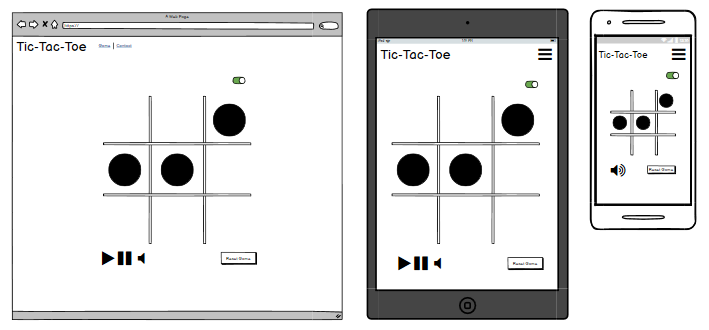
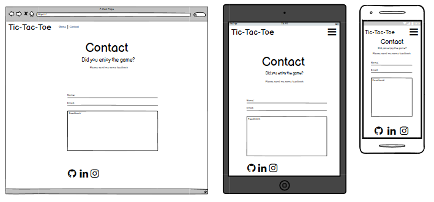

<h1 align="center">TicTacToe</h1>

[View the live project here.](https://codeinstitute.net)

Welcome to my second milestone project provided by [Code Institute](https://codeinstitute.net). For this project I am going to do a Tic Tac Toe Game. I hope you will enjoy it!

<h2 align="center"></h2>

## User Experience (UX)

-   ### User stories

    - As a First Time Visitor,

        1. I want to get clear instructions on how the site works, what you can do, and how to do it.
        2. I want to easily navigate my way through the website. 

    - As as user,
    
        1. I want the game to be played easily.
        2. I want feedback once the game is done, such as who won.
        3. I want to reset the game when the game is finished.
        4. I want to know if the author has done some other games.  
        

-   ### Design
    -   #### Colour Scheme
        
    -   #### Typography
        
    

-   ### Wireframes

    Home Page.
    - 
    Contact Page.
    - 

## Features


## Technologies Used

### Languages Used

-   [HTML5](https://en.wikipedia.org/wiki/HTML5)
-   [CSS3](https://en.wikipedia.org/wiki/Cascading_Style_Sheets)
-   [javaScript]()

### Frameworks, Libraries & Programs Used

- [jQuery](https://jquery.com/)
- [Bootstrap v5.0](https://getbootstrap.com/docs/5.0/getting-started/introduction/)
- [Hover.css](https://ianlunn.github.io/Hover/) - Hover effect on buttons.
- [fontAwesome](https://fontawesome.com/) - provides icons across the sit

## Testing


### Testing User Stories from User Experience (UX) Section


### Further Testing


### Known Bugs


## Deployment

### GitHub Pages

The project was deployed to GitHub Pages using the following steps...

1. Log in to GitHub and locate the [GitHub Repository](https://github.com/)
2. At the top of the Repository (not top of page), locate the "Settings" Button on the menu.
    - Alternatively Click [Here](https://raw.githubusercontent.com/) for a GIF demonstrating the process starting from Step 2.
3. Scroll down the Settings page until you locate the "GitHub Pages" Section.
4. Under "Source", click the dropdown called "None" and select "Master Branch".
5. The page will automatically refresh.
6. Scroll back down through the page to locate the now published site [link](https://github.com) in the "GitHub Pages" section.

### Forking the GitHub Repository

By forking the GitHub Repository we make a copy of the original repository on our GitHub account to view and/or make changes without affecting the original repository by using the following steps...

1. Log in to GitHub and locate the [GitHub Repository](https://github.com/)
2. At the top of the Repository (not top of page) just above the "Settings" Button on the menu, locate the "Fork" Button.
3. You should now have a copy of the original repository in your GitHub account.

### Making a Local Clone

1. Log in to GitHub and locate the [GitHub Repository](https://github.com/)
2. Under the repository name, click "Clone or download".
3. To clone the repository using HTTPS, under "Clone with HTTPS", copy the link.
4. Open Git Bash
5. Change the current working directory to the location where you want the cloned directory to be made.
6. Type `git clone`, and then paste the URL you copied in Step 3.

```
$ git clone https://github.com/YOUR-USERNAME/YOUR-REPOSITORY
```

7. Press Enter. Your local clone will be created.

```
$ git clone https://github.com/YOUR-USERNAME/YOUR-REPOSITORY
> Cloning into `CI-Clone`...
> remote: Counting objects: 10, done.
> remote: Compressing objects: 100% (8/8), done.
> remove: Total 10 (delta 1), reused 10 (delta 1)
> Unpacking objects: 100% (10/10), done.
```

Click [Here](https://help.github.com/en/github/creating-cloning-and-archiving-repositories/cloning-a-repository#cloning-a-repository-to-github-desktop) to retrieve pictures for some of the buttons and more detailed explanations of the above process.

## Credits

### Code


### Content


-   Psychological properties of colours text in the README.md was found [here](http://www.colour-affects.co.uk/psychological-properties-of-colours)

### Media


### Acknowledgements

- The layout inspration for this README.md is from Code Institute's own [Sample README](https://github.com/Code-Institute-Solutions/SampleREADME).

