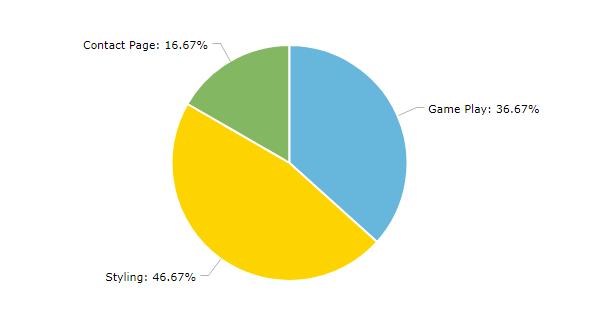
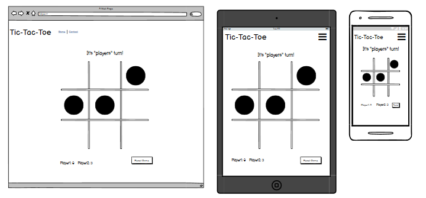
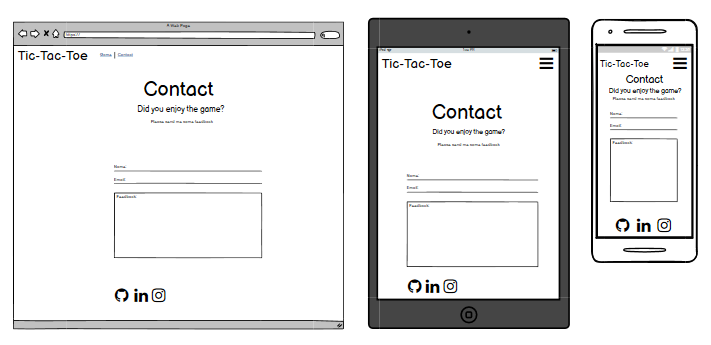
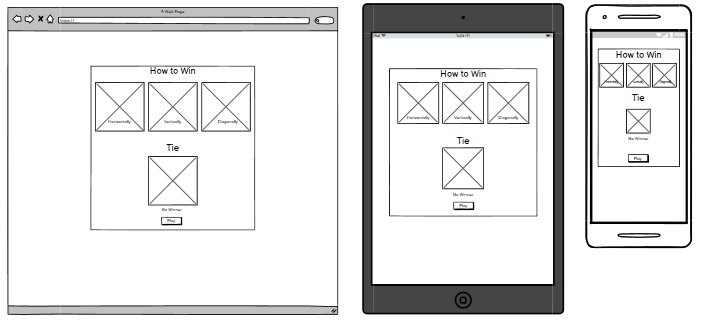

<h1 align="center">TicTacToe</h1>

[View the live project here.](https://kagebounshin.github.io/tictactoe-milestoneProjectNr2/)

Welcome to my second milestone project provided by [Code Institute](https://codeinstitute.net). For this project I am going to do a Tic Tac Toe Game. I hope you will enjoy it!

<h2 align="center"></h2>

## Table Of Content
1.[**UX**](#user-experience) 
- [**Strategy**](#strategy)
- [**Scope**](#scope)
- [**Structure**](#structure)
- [**Skeleton**](#skeleton)
    - [**Wireframes**](#wireframes)
- [**Surface**](#surface)
    - [**Design**](#design)
- [**User Stories**](#user-stories)


2.[**Features**](#features)
- [**Existing Features**](#existing-features)
- [**Features For The Future**](#features-for-the-future)

3.[**Technologies**](#technologies-used)


4.[**Testing**](#testing)

5.[**Deployment**](#deployment)

6.[**Credits**](#credits)
- [**Content**](#content)
- [**Media**](#media)
- [**Acknowledgements**](#acknowledgements)


## User Experience

### Strategy

- My targeted audience for this project is children somewhere between the ages of 4-9 years old. In most cases when two adults plays against each other it ends in a draw, unless your not familiar with the basic strategy of the game. So the Tic-tac-toe game is very simple, so it's well suited for children who dont already know the basic strategy. So I will try to make it appealing to kids at first. Having in mind what kids are interested in now a days, such as sports, tv-series, toys etc. 

- I made up a very simple chart, by asking my own kids and some of their friends. I wanted to know their thought on what they think is important for this project. So they had three choices to make, between "Game Play", "Styling" and the "Contact page". They were going to rank these choices between 1-3.
 <h2 align="center"></h2>

- The one who got the most points was "Styling". And I intend to agree, if my main target is children, I want it to look interesting and fun. Have things going on in the background. Other things to interact with besides the game itself. So the kids will keep on playing, and visit the site again. 
- The second most was the "Game Play" choice. Though I would think it's more important then the styling. Without a functional game, then what's the purpose of the page. 
- Not a shocker that the "Contact Page" got the least points. So I will focus on doing a visually striking and fun game at first. The implementing of a "Contact Page" will maybe be a feature to add in the future. But if I feel that I've got the time to do it, then I probably will. 

### Scope

- So alot of styling and a fun and intuitive gameplay is most important.
- The first thats needed are instructions, what the game is about and how does it work. Ofcourse it's a simple game, but when you are aproaching children I think it's best to be as clear as you can be, sort out the questions they may have, before you even start the game. I will implement some easy to understand instructions to be shown when they enter the site. The instructions will be picture based, showing them the steps you need to take to win the game. Im thinking three pictures wich shows three winning combinations horizontally, vertically & diagonally. And a picture wich display a tie. Look at the instruction [**wireframe**](#wireframes) to get my idea.
- To make it more fun to play I will put in a countdown timer, so the choices they make must be made quickly, if the time runs out, the game stops, and it's a tie. Choose to restart, and finish the game before the timer runs out.
- I also going to implement a scoreboard, displaying how many matches each of the players have won, and how many times it has ended in a tie. So that you'll get that competetive feeling. 

### Structure


- Navbar
    - At the top of the page I will have a navigation bar. There will not be much to navigate between at first just the "Game" and the "Contact" page. 
    - When shown on smaller devices the navigation links will collapse into a toggler menu. With a button to click to reveal the links.
    - When you'll hover the brand or one of the links, the links will response with an effect. Just to make it easier to understand that they can be clicked. 
    - By having the navbar at the top it will be easy to spot at your first visit to the site. 

- Game Page

    - The "Game" page will be the home page of this site. After you get some game instructions you can choose to start playing the game.
    - The gameboard will be displayed at the center of the page. The board will have a 3x3 grid, all with equally sized squares, in these squares you will put your X's & O's. When you hover over the diffrent squares they will respond. So you'll know wich square your about to put your mark on. 
    - Above the gameboard to the left there will be a text wich will display who's turn it is. 
    - Above the gameboard to the right, there the countdown timer will be.
    - Below the gameboard there will be a restart button.
    - Below the gameboard there will also be a scoreboard.
    - At the end of the game, the winner will be displayed, and you will be able to restart the game by the click of a button.

- Contact Page
    - The "Contact" Page will have a form centered at the page. there will be a simple looking form, were you can enter your name, email, and feedback.
    - The form will be conected with emailJS.
    - Below the form their will be links to my LinkedIn, gitHub & Instagram.

### Skeleton

-   ### Wireframes

    Home Page.
    - 
    Contact Page.
    - 
    Instruction modal.
    - 

### Surface 

-   ### Design
    -   #### Colour Scheme
        
    -   #### Typography
        

### User stories


- As a First Time Visitor,

    1. I want to get clear instructions on how the site works, what you can do, and how to do it.
    2. I want to easily navigate my way through the website. 

- As as user,
    
    1. I want the game to be played easily.
    2. I want it to have nice estetics. 
    3. I want feedback once the game is done, such as who won. 
    4. I want to restart the game when the game is finished.
    5. I want to know if the author has done some other games. 
         
    
    

## Features


## Technologies Used

### Languages Used

-   [HTML5](https://en.wikipedia.org/wiki/HTML5)
-   [CSS3](https://en.wikipedia.org/wiki/Cascading_Style_Sheets)
-   [javaScript]()

### Frameworks, Libraries & Programs Used

- [jQuery](https://jquery.com/)
- [Bootstrap v5.0](https://getbootstrap.com/docs/5.0/getting-started/introduction/)
- [Hover.css](https://ianlunn.github.io/Hover/) - Hover effect on buttons.
- [fontAwesome](https://fontawesome.com/) - provides icons across the sit
- [GoogleFonts](https://fonts.google.com/)

## Testing


### Testing User Stories from User Experience (UX) Section


### Further Testing


### Known Bugs


## Deployment

### GitHub Pages

The project was deployed to GitHub Pages using the following steps...

1. Log in to GitHub and locate the [GitHub Repository](https://github.com/)
2. At the top of the Repository (not top of page), locate the "Settings" Button on the menu.
    - Alternatively Click [Here](https://raw.githubusercontent.com/) for a GIF demonstrating the process starting from Step 2.
3. Scroll down the Settings page until you locate the "GitHub Pages" Section.
4. Under "Source", click the dropdown called "None" and select "Master Branch".
5. The page will automatically refresh.
6. Scroll back down through the page to locate the now published site [link](https://github.com) in the "GitHub Pages" section.

### Forking the GitHub Repository

By forking the GitHub Repository we make a copy of the original repository on our GitHub account to view and/or make changes without affecting the original repository by using the following steps...

1. Log in to GitHub and locate the [GitHub Repository](https://github.com/)
2. At the top of the Repository (not top of page) just above the "Settings" Button on the menu, locate the "Fork" Button.
3. You should now have a copy of the original repository in your GitHub account.

### Making a Local Clone

1. Log in to GitHub and locate the [GitHub Repository](https://github.com/)
2. Under the repository name, click "Clone or download".
3. To clone the repository using HTTPS, under "Clone with HTTPS", copy the link.
4. Open Git Bash
5. Change the current working directory to the location where you want the cloned directory to be made.
6. Type `git clone`, and then paste the URL you copied in Step 3.

```
$ git clone https://github.com/YOUR-USERNAME/YOUR-REPOSITORY
```

7. Press Enter. Your local clone will be created.

```
$ git clone https://github.com/YOUR-USERNAME/YOUR-REPOSITORY
> Cloning into `CI-Clone`...
> remote: Counting objects: 10, done.
> remote: Compressing objects: 100% (8/8), done.
> remove: Total 10 (delta 1), reused 10 (delta 1)
> Unpacking objects: 100% (10/10), done.
```

Click [Here](https://help.github.com/en/github/creating-cloning-and-archiving-repositories/cloning-a-repository#cloning-a-repository-to-github-desktop) to retrieve pictures for some of the buttons and more detailed explanations of the above process.

## Credits

### Code


### Content


-   Psychological properties of colours text in the README.md was found [here](http://www.colour-affects.co.uk/psychological-properties-of-colours)

### Media


### Acknowledgements

- The layout inspration for this README.md is from Code Institute's own [Sample README](https://github.com/Code-Institute-Solutions/SampleREADME).