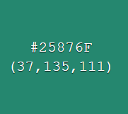
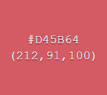

<h1 align="center">TicTacToe</h1>

[View the live project here.](https://kagebounshin.github.io/tictactoe-milestoneProjectNr2/)

Welcome to my second milestone project provided by [Code Institute](https://codeinstitute.net). For this project I am going to do a Tic Tac Toe Game. I hope you will enjoy it!

<h2 align="center"></h2>

## Table Of Content
1.[**UX**](#user-experience) 
- [**Strategy**](#strategy)
- [**Scope**](#scope)
- [**Structure**](#structure)
- [**Skeleton**](#skeleton)
    - [**Wireframes**](#wireframes)
- [**Surface**](#surface)
    - [**Design**](#design)
- [**User Stories**](#user-stories)


2.[**Features**](#features)
- [**Existing Features**](#existing-features)
- [**Features For The Future**](#features-for-the-future)

3.[**Technologies**](#technologies-used)


4.[**Testing**](#testing)

5.[**Deployment**](#deployment)

6.[**Credits**](#credits)
- [**Content**](#content)
- [**Media**](#media)
- [**Acknowledgements**](#acknowledgements)


## User Experience

### Strategy

- My targeted audience for this project is children somewhere between the ages of 4-9 years old. In most cases when two adults plays against each other it ends in a draw, unless your not familiar with the basic strategy of the game. So the Tic-tac-toe game is very simple, so it's well suited for children who dont already know the basic strategy. So I will try to make it appealing to kids at first. Having in mind what kids are interested in now a days, games, toys, etc. 

- I made up a very simple chart, by asking my own kids and some of their friends. I wanted to know their thought on what they think is important for this project. So they had three choices to make, between "Game Play", "Styling" and the "Contact page". They were going to rank these choices between 1-3.
 <h2 align="center"></h2>

- The one who got the most points was "Styling". And I intend to agree, if my main target is children, I want it to look interesting and fun. Have things going on in the background. Other things to interact with besides the game itself. So the kids will keep on playing, and visit the site again. 
- The second most was the "Game Play" choice. Though I would think it's more important then the styling. Without a functional game, then what's the purpose of the page. 
- Not a shocker that the "Contact Page" got the least points. So I will focus on doing a visually striking and fun game at first. The implementing of a "Contact Page" will maybe be a feature to add in the future. But if I feel that I've got the time to do it, then I probably will. 

### Scope

- So alot of styling and a fun and intuitive gameplay is most important.
- The first thats needed are instructions, what the game is about and how does it work. Ofcourse it's a simple game, but when you are aproaching children I think it's best to be as clear as you can be, sort out the questions they may have, before you even start the game. 
I will implement some easy to understand instructions to be shown when they enter the site. The instructions will be picture based, showing them the steps you need to take to win the game. 
I'm thinking three pictures wich displays three winning combinations horizontally, vertically & diagonally. And a picture wich displays a tie. Look at the instruction [**wireframe**](#wireframes) to see my idea.
- There will be a text displaying whos turn it is. 
- To make it more fun to play I will put in a countdown timer, so the choices they make must be made quickly, if the time runs out, the game stops, and it's game over.
- I also going to implement a scoreboard, displaying how many matches each of the players have won. So that you'll get that competetive feeling. 

### Structure


- Navbar
    - At the top of the page I will have a navigation bar. There will not be much to navigate between at first just the "Game" and the "Contact" page. 
    - When shown on smaller devices the navigation links will collapse into a toggler menu. With a button to click to reveal the links.
    - When you'll hover the brand or one of the links, the links will response with an effect. Just to make it easier to understand that they can be clicked. 
    - By having the navbar at the top it will be easy to spot at your first visit to the site. 

- Game Page

    - The "Game" page will be the home page of this site.
    - The gameboard will be displayed at the center of the page. The board will have a 3x3 grid, all with equally sized squares, in these squares you will put your X's & O's. When you hover over the diffrent squares they will respond. So you'll know wich square your about to put your mark on. 
    - Above the gameboard to the left there will be a text wich will display who's turn it is. 
    - Above the gameboard to the right, there the countdown timer will be.
    - Below the gameboard there will be a restart button.
    - Below the gameboard there will also be a scoreboard.
    - At the end of the game, the winner will be displayed, and you will be able to restart the game by the click of a button.

- Tutorial Page
    - If your not entirely sure on how to play Tic-Tac-Toe, dont worry, I've implemented and easy to understand tutorial page.
    - The page display pictures on the three diffrent ways you can win, and how a possible "Tie" situation looks like. 
    - And it explains the timer and the turn containers. 

- Contact Page
    - The "Contact" Page will have a form centered at the page. there will be a simple looking form, were you can enter your name, email, and feedback.
    - The form will be conected with emailJS.
    - Below the form their will be links to my LinkedIn, gitHub & Instagram.

### Skeleton

-   ### Wireframes

    Home Page.
    - 
    Contact Page.
    - 
    Instruction modal.
    - 

### Surface 

-   ### Design
    - #### Colour Scheme
        - Text Colors

        The body element of all the pages is set to have the color #000000, Have styles some text across the pages white the colr #ffffff. 
        
        The form at the contact page has the color #212529 set to it's text.

        
        
        
        
        
        - Navbar

        The Navbar has the #fff8e6 background across all pages, I wanted a more smooth and pleasing color instead of a basic #fff. And the text has the #000000 color.  
       
        
        

        - Game Page
         
        At the Game Page you can click a button wich will randomly change the background color, the colors that the background randomly changes to is dispayed below this text.
            
        
        
        
        
        
        
        
        

        The Gameboard has the #fff8e6 color as background, and the box shadow is faded to 65% from the color #000000 (black).

        The Button wich changes the background of the page has the same background color as the gamboard #fff8e6, and the box shadow is faded to 65% from the color #000000 (black).
        
        - Tutorial Page

        The background for the tutorial page is set to the #7fc3cc.

        
        
        - Contact Page

        The background for the contact page is set to #fc9819.

        


    -   #### Typography

        

### User stories


- As a First Time Visitor,

    1. I want to get clear instructions on how the site works, what you can do, and how to do it.
    2. I want to easily navigate my way through the website.  

- As as user,
    
    1. I want the game to be played easily.
    2. I want it to have nice estetics. 
    3. I want feedback once the game is done, such as who won, and whats the score. 
    4. I want to restart the game when the game is finished.
    5. I want to know if the author has done some other games. 
         
## Features

- Navbar
    - The three diffrent pages on the site has the same looking Navbar, except some minor styling changes. The Navbrand takes you to the game page.

- Game Page
    - The game page has a text wich displays whos turn it is. The Game is set to start with the player "X" as default. When you start playing the turn text switches between the player "X" & "O" depending whos turn it is.
    - There is a "Timer" wich count down from 20. If the timer run out, it display's a gameover message. 
    - The Gameboard is at the center of the screen, the 9 diffrent spaces where you can make your mark has a hover effect on them, the effect slitly shrinks the hovered space. 
    - Below the gameboard there is a score counter, wich displaye's the score for player "X" and player "O". 
    - At the bottom of the page, there is a "Change Background" button, and guess what, it changes the background of the page. 

- Tutorial Page
    -

- Contact Page

## Features for the future

- I would like to implement so that the players can set there name, so that the turn order is displayed with the players names instead of the "X" and the "O".
- I would like to implement audio to the gameboard, so when any tile is clicked, a click sound is played. 


---


## Technologies Used

### Languages Used

-   [HTML5](https://en.wikipedia.org/wiki/HTML5)
-   [CSS3](https://en.wikipedia.org/wiki/Cascading_Style_Sheets)
-   [JavaScript](https://www.javascript.com/)

### Frameworks, Libraries & Programs Used

- [jQuery](https://jquery.com/)

- [Bootstrap v5.0](https://getbootstrap.com/docs/5.0/getting-started/introduction/)

- [Hover.css](https://ianlunn.github.io/Hover/) - Hover effect on buttons.

- [FontAwesome](https://fontawesome.com/) - provides icons across the sit

- [GoogleFonts](https://fonts.google.com/)

- [Git](https://git-scm.com/) - Git was used for version control.

- [GitHub](https://github.com/) - GitHub was used to store the project.

- [GitHubPages](https://pages.github.com/) - Deployment

- [Balsamiq](https://balsamiq.com/) - Balsamiq was used to create the wireframes.

- [Am I Responsive](http://ami.responsivedesign.is/#) - Tested responsivness & the images at the top of the readMe.

- [Color Hex](https://www.color-hex.com/) - The color images wich are displayed at the [**Design**](#design) section of this readMe.

- [EmailJS](https://www.emailjs.com/) - For the contact form.


---

## Testing


### Testing User Stories from User Experience (UX) Section

#### Game Testing

- Make Mark
    - I enter the site, I'll make my mark anywhere at the gameboard, and an "X" appear
    - The next mark I make displays an "O". 
    - Now it is the X's turn again, I try to click where the "O" was marked, nothing happends. I need to choose an unoccupied space at the gameboard. 
    - I fill up the rest of the gameboard, switching between the X's and O's
    
- Take Turns
    - The turn display shows that the X's goes first
    - When I make my first mark on the gameboard, an X appears on the clicked element
    - The turn container switches to display that it's the O's turn
    - I make a new mark and an O appears on the gameboard.
    - The turn container switches back to display that it's the X's turn once again

- Score Counter
    - I play a game and player "X" wins.
    - The score counter for player "X" increases with 1.
    - I play a game and player "O" wins.
    - The score counter for player "O" increases with 1.
    - I play a game and make it a "Tie".
    - The Score is unchanged

- Restart Button
    - I wait for the time to run out, so I can see the game over message.
    - I click the restart button and the game restarts
    - I play a game and winning with player "X".
    - I click the restart button and the game restarts
    - I play a game and winning with player "O".
    - I click the restart button and the game restarts
    - I play a game and I make it a "Tie".
    - I click the restart button and the game restarts
    
#### Testing of the contact form
- When I enter the site, I locate the contact link at the navbar.
- I click the link and it takes me to the Contact page.
- The page have a feedback form, before submitting the form, I enter my name, emailaddress and a feedback message. 
- I click at the "Send" button under the form, The message is sent to my Gmail account, the form is reset back to it's default state, and it displays a message above the form thanking you for submitting. 
- If I dont fill in the form correctley before submitting, lets say leaving the email input window empty, a message will be displayed saying I need to include a emailaddress if I want to submit the form. 

### Further Testing


### Known Bugs


---

## Deployment
 
### GitHub Pages

My project was deployed to GitHub Pages, following these steps..

1. Log in to [GitHub](https://github.com/) and locate the [GitHub Repository](https://kagebounshin.github.io/tictactoe-milestoneProjectNr2/).
2. At the top of the Repository, locate the "Settings" Button on the menu.
3. Scroll down the Settings page until you locate the "GitHub Pages" Section.
4. Under "Source", click the dropdown called "None" and select "Master Branch".
5. The page will refresh.
6. Scroll back down through the page to locate the now published site in the "GitHub Pages" section.


### Forking the GitHub Repository

By forking the GitHub Repository you can make a copy of the original repository to your GitHub account to just view or make changes without affecting the original. Use these steps or press this [link](https://docs.github.com/en/github/getting-started-with-github/fork-a-repo).

1. Log in to [GitHub](https://github.com/) and locate the [GitHub Repository](https://github.com/Kagebounshin/neverday-milestone-project-1).
2. In the top-right corner of the page, click Fork.
3. Now you will have a copy of the original repository in your GitHub account.

### Making a Local Clone

Follow these steps or press this [link](https://docs.github.com/en/github/creating-cloning-and-archiving-repositories/cloning-a-repository#cloning-a-repository-to-github-desktop).

1. Log in to GitHub and locate the [GitHub Repository](https://kagebounshin.github.io/tictactoe-milestoneProjectNr2)
2. Above the list of files, click "Code".
3. To clone the repository using HTTPS, under "Clone with HTTPS", copy the link.
4. Open Git Bash
5. Change the current working directory to the location where you want the cloned directory to be made.
6. Type `git clone`, and then paste the URL you copied in Step 3.

```
$ git clone https://kagebounshin.github.io/tictactoe-milestoneProjectNr2
```

7. Press Enter to create your local clone.

```
$ git clone https://kagebounshin.github.io/tictactoe-milestoneProjectNr2
> Cloning into `CI-Clone`...
> remote: Counting objects: 10, done.
> remote: Compressing objects: 100% (8/8), done.
> remove: Total 10 (delta 1), reused 10 (delta 1)
> Unpacking objects: 100% (10/10), done.
```

---

## Credits

### Code

- The Structure for this game was obtained from [Anna Peterson](https://medium.com/@annapeterson89) and her tutorial "[The World’s Most Empowering Tic-Tac-Toe JavaScript Tutorial](https://javascript.plainenglish.io/the-worlds-most-empowering-tic-tac-toe-javascript-tutorial-a889e4c20883)". 

### Content


### Acknowledgements

- The layout inspration for this README.md is from Code Institute's own [Sample README](https://github.com/Code-Institute-Solutions/SampleREADME).

- Thanks to [Anna Peterson](https://medium.com/@annapeterson89) for making it easy to understand the structure of a Tic-Tac-Toe game. 